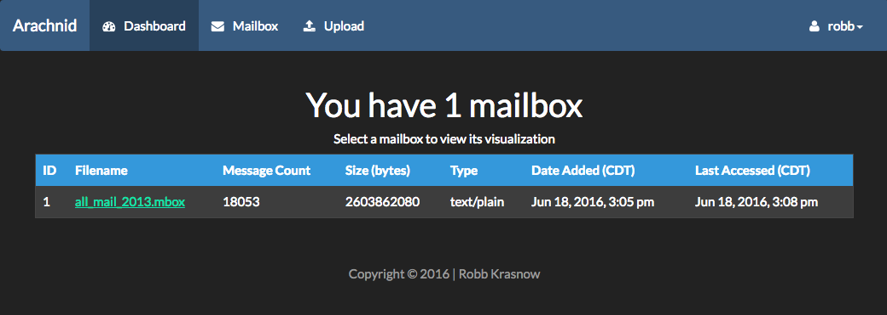
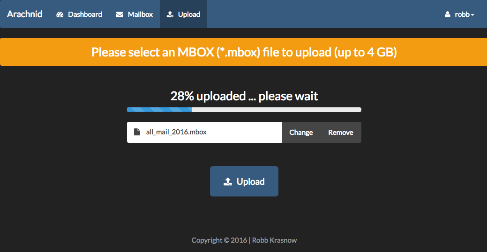
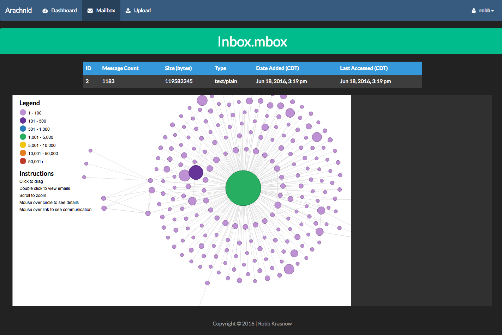
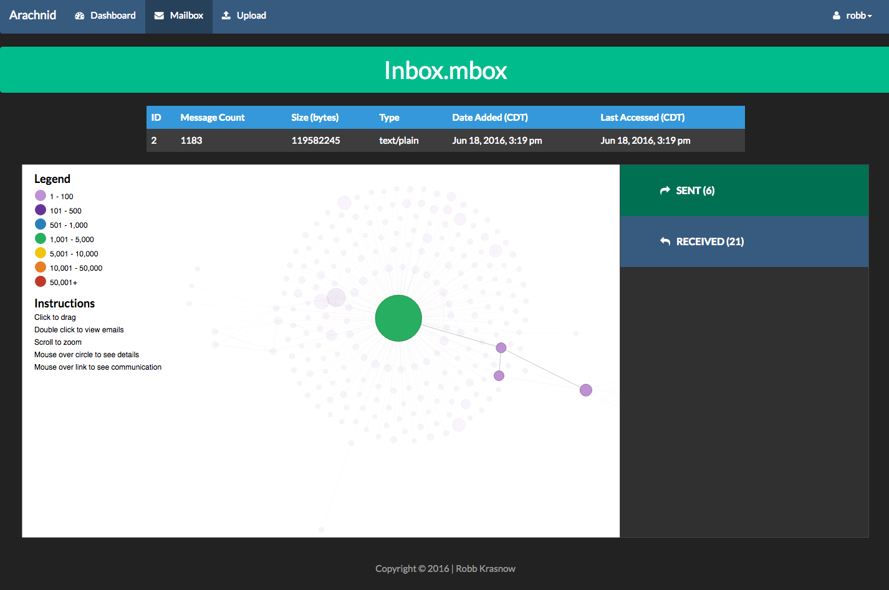
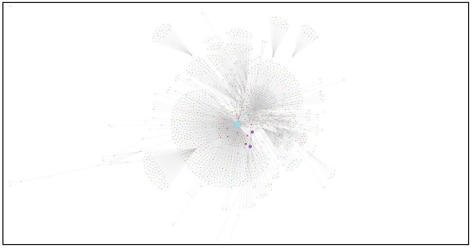

Arachnid
============
A web-based tool for visualizing and interacting with web email.

When locating patterns, the human eye is keen on using colors, shapes, and sizes to create connections that the brain may not perceive in plain text. Using these patterns, various parts of forensic investigations may become engaged more quickly if the eye is able to see an overview of small or large datasets in a single interactive view. Thus, the investigator has the ability to pinpoint areas deemed “curious” and to zoom in on information believed ultimately necessary. With the popularity and free nature of Web email in this day and age, anyone from a kindergarten student to a senior citizen, from the President to a hacker, use services such as Gmail, Yahoo! Mail, or Hotmail. However, intentions of registered users may vary. While some use it for business practices or personal affairs, others pursue malicious activities. Furthermore, these services also allow users to have extremely large inboxes for storage. This makes finding patterns more difficult for an investigator. Therefore, the goal of Arachnid is to bridge this gap, giving forensic investigators, as well as students, the ability to not only peer into a suspect’s email but also delve further into that inbox to visualize the overall usage of the account in order to understand the behavior and habits of its user.

    * Quickly upload .mbox files to get an overview of a user's mailbox
    * Zoom in on a particularly interesting area of a mailbox
    * Focus your attention on a set of emails pertaining to a particular user
    * Locate your evidence quicker than if you were to search through all emails by hand

Dashboard
------------------
See every mailbox you've uploaded and click on it to render it's visualization.

Upload
-------------------
Upload a valid .mbox email file. Sample mailboxes are located in ./mailboxes

Mailbox
----------------
Search, manage, and export rules matching specific criteria

Focus on a specific email address/set of messages.

A complete overview of my 3GB Gmail account

Installation (Development environment)
---------------------------------------------------------------------
Please follow the **installation_and_user_guide.pdf** located in **./docs/guides**. Arachnid may be installed in any web directory you have set up, however this guide shows a sample setup using XAMPP on a Mac.

Please also note that mailboxes contain sensitive data and should you install this within your corporate environment, make sure the proper security permissions are in place so users not involved in your forensic case may not view your data.

If you run into any issues, please reach out.

Research
-------
If anyone is interested in the research behind this tool, please ping me on the Slack channel listed below.

Slack
-----
I have set up a Slack channel at [Arachnid Forensic Slack Channel](arachnid-forensic.slack.com) or anyone who would like to ping me with questions, concerns or issues. 

Contributing
------------
For those who are interested in contributing to Arachnid, please take a moment to look over the [Contribution Guidelines](./CONTRIBUTING.md).

License
-------
Arachnid is filed under the Apache License version 2.0. Please see [License](./LICENSE) for more details.